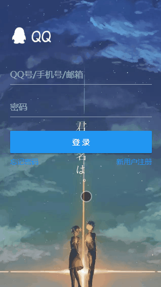
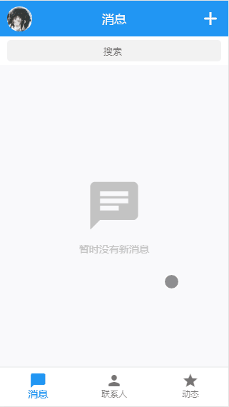
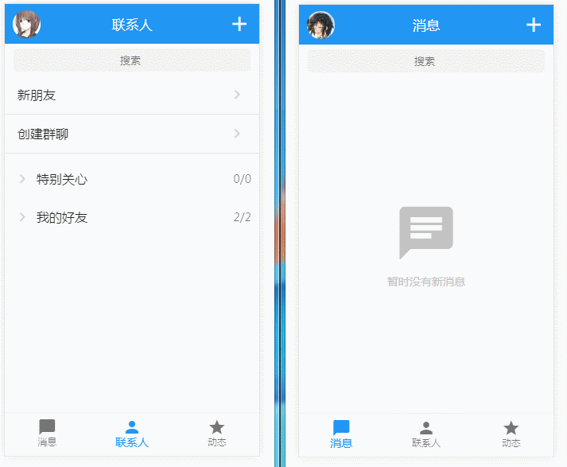
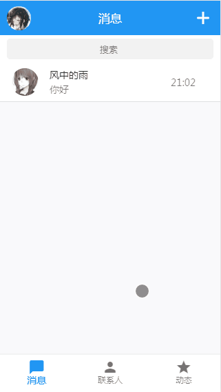

# 无意间看到了该项目还有人在fork，挺意外的，当时开发该项目已经是我大四的时候，如今我已经工作快三年了，已经过去4年了。看到还有人在fork，决定将其完善一下，同时补上后端的代码（node），如果有兴趣参与的可以加我QQ(1317915039)，最好是有一定前端基础，对git有一定使用经验的。

# 仿手机QQ

## 概述

本项目基于Vue2进行高仿手机QQ的webapp，UI上使用的是museUI，使用springMVC搭建的后台。聊天方面，使用WebSocket实现浏览器与服务器全双工通信，允许服务器主动发送信息给客户端。源码大部分有注释，如果不清楚的可以Issues我，我会尽量回复的。


## 项目已实现功能

- 登录、注册——注册完成系统返回一个id，用id加密码即可登录

- 添加好友——右上角加号点开，输入用户id即可完成添加（暂未实现用户验证添加）

- 聊天功能——好友之间可以实时在线通信，无论你在哪个页面都能收到好友消息（退出不行）

- 长按删除——长按删除已有的消息

- 项目中数据流动由vuex进行控制


## 动图预览

gif有些失真，看官可以clone后本地查看。

--登录与注册--



--侧边栏与个人主页--



--长按删除--



--添加好友--



--好友聊天--


## 感谢
感谢您的来访 ，如果对于您有帮助 ，麻烦您给个Star吧 ！ 


## 其他说明

- 本项目还有很多bug，各位大佬如果发现了，可以通知我下，我会非常感激的

- 本项目还有很多功能没实现，如果你发现点击没反应，那很可能是我只写了个ui在那

- 项目暂不支持聊天记录缓存，一旦你退出系统，聊天记录将清空

- 这是我使用vue做的第二个webapp，虽然还是不怎么样，有兴趣的可以去看下我的第一个webapp——医院管理信息系统
  项目地址 <a href="https://github.com/linguoqiang001/his">https://github.com/linguoqiang001/his</a>

- 最近比较忙，暂时就做到这，后面有时间的话会继续完善项目，后台和数据库部分，有时间我整理下一并上传


## 技术栈

-  vue-cli
-  vue2
-  vue-router
-  vuex
-  axios
-  less
-  webpack2
-  muse-ui


## Build Setup

``` bash
# 安装
npm install

# 运行
npm run dev

# 发布
npm run build
